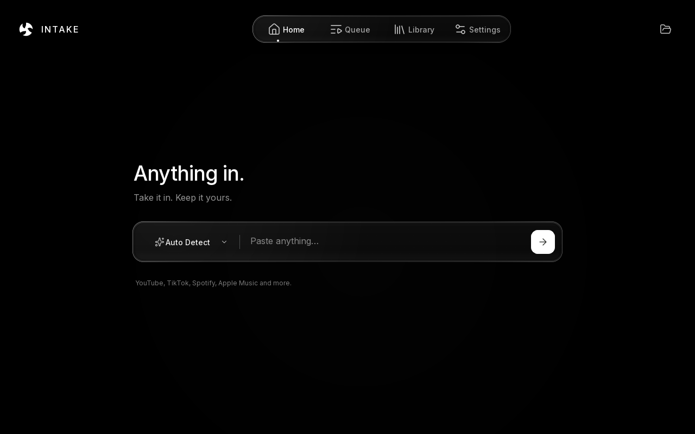
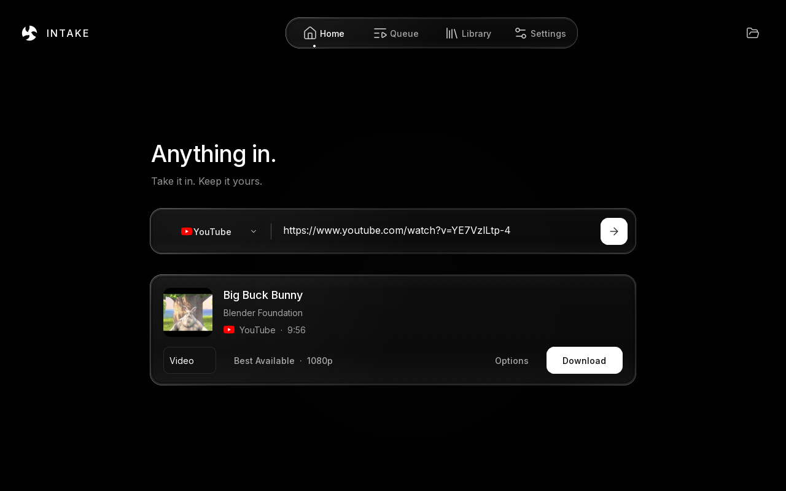
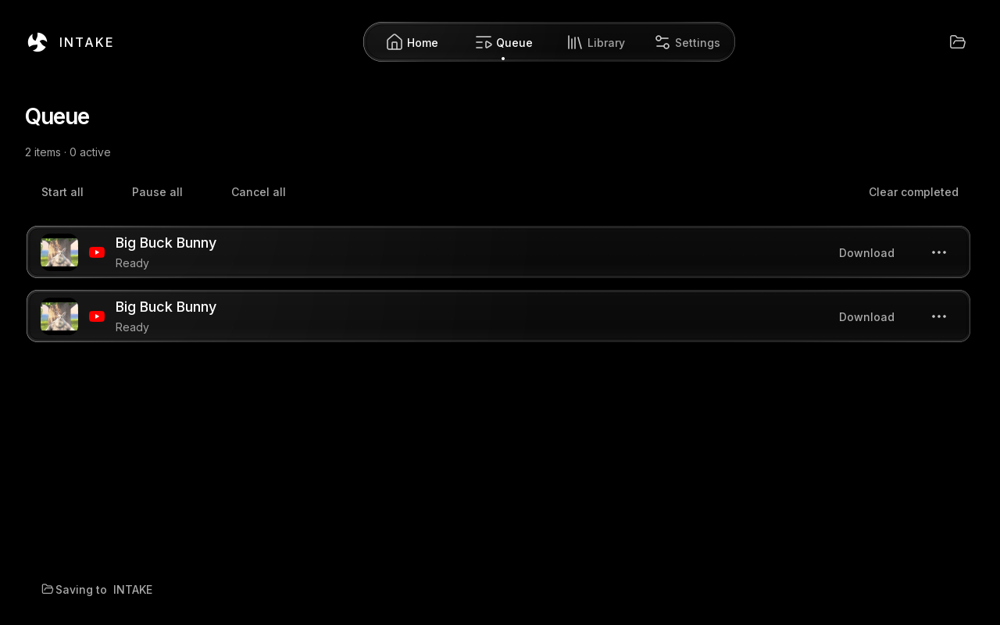

# INTAKE

**Universal Media Downloader**

Take it in. Keep it yours.

**[Download for Windows](https://github.com/LASTKING12093/intake/releases/latest/download/Intake-Setup-x64.exe)** · [Portable ZIP](https://github.com/LASTKING12093/intake/releases/latest/download/Intake-Portable-x64.zip) · [Build from source](BUILDING.md)

INTAKE turns a media link into a file you can keep. Paste a URL, review what it found, and download. Quality is chosen automatically; formats and other controls appear when you need them.

## Why INTAKE?

One focused workflow, a local library, and control over the files you download. The native desktop interface pairs an OLED-black canvas with glass surfaces, full-color source icons and always-on motion.

## Features

- Automatic source detection and best-available quality by default.
- Video and audio downloads, batch links and supported playlists.
- A queue with bounded concurrency, pause/resume, cancellation and retry.
- A searchable local library with open, reveal and metadata actions.
- Format, codec, quality, subtitle and destination controls.
- Metadata, artwork and optional lyrics where the source provides them.
- An on-demand extractor updater that verifies publisher SHA-256 hashes before replacing the engine.

## Preview

The screenshots use a clean demonstration profile and Big Buck Bunny identification/artwork (Blender Foundation, CC BY 3.0; see third-party notices). They show the released interface; no personal history or desktop content is included.

## Supported sources

| Source | What to expect |
| --- | --- |
| YouTube | Videos, audio and public playlists supported by yt-dlp. |
| TikTok | Public media supported by the bundled yt-dlp extractor. |
| Spotify | Public catalog metadata, then a visible recording match from a compatible source. |
| Apple Music | Public catalog metadata, then a visible recording match from a compatible source. |
| Other sites | Public HTTP(S) media recognized by yt-dlp. Availability varies by site. |

Spotify and Apple Music links identify recordings; INTAKE does **not** extract their DRM-protected streams or pass preview clips off as full tracks. Uncertain matches require review. Some public collections expose only part of their catalog, and sites may block anonymous requests. No account sign-in or browser-cookie import is included.

## How it works

**Paste → Detect → Download → Done.**

Paste a link and press Enter. Check the result, choose video or audio, and download. Open **Options** for finer control; follow active jobs in **Queue** and completed items in **Library**.

## Installation

1. Download **Intake-Setup-x64.exe** from the [latest release](https://github.com/LASTKING12093/intake/releases/latest).
2. Run the installer, then launch INTAKE from the Start menu.

Windows 10 (1809 or later) or Windows 11, x64. Python, FFmpeg, yt-dlp and Deno are included; no separate runtime installation is required. Windows 11 x64 is the locally tested platform.

The release is **unsigned**. Windows SmartScreen may warn about a new, unrecognized application. Download from this repository and compare the file with the release's **SHA256SUMS.txt** before deciding whether to run it.

The portable ZIP runs without an installer: extract the whole folder and open `INTAKE.exe`. Keep its companion folders together. Portable describes installation; settings and library state still use the current user's application-data folder. Uninstalling INTAKE preserves downloaded media and user settings.

## Privacy

No INTAKE account, analytics or telemetry service. Settings, queue state, logs and library metadata stay on your computer. INTAKE contacts the sites you request, artwork providers, public catalog/search services and LRCLIB when lyrics are requested. Updating the extractor contacts GitHub. Those services receive normal network information such as your IP address.

The clipboard is read only when you paste. INTAKE does not import browser sessions or cookies. Logs redact web URLs, but paths and media titles can still appear: review diagnostics before sharing them. Downloaded files and locally stored library links are not encrypted.

## Build and contribute

[Build instructions](BUILDING.md) cover development, testing, portable builds and the Windows installer. [Contributions](CONTRIBUTING.md) and focused bug reports are welcome. Report vulnerabilities through the [private security process](SECURITY.md).

## License

Original INTAKE code is [MIT licensed](LICENSE). Bundled software and assets retain their own licenses, including LGPL/GPL components; see [third-party notices and source access](THIRD_PARTY_NOTICES.md).

INTAKE is intended for downloading content you are authorized to access and keep. Users are responsible for applicable laws and platform terms. INTAKE does not bypass DRM.
